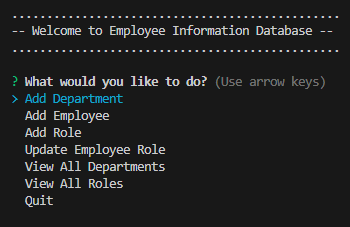
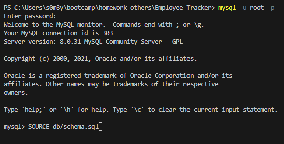
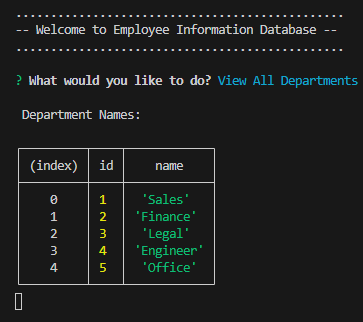

# Employee Tracker

## Table of Contents (Optional)

- [Description](#description)
- [Installation](#installation)
- [Usage](#usage)
- [Credits](#credits)
- [License](#license)
- [Tests](#tests)
- [Questions](#questions)

## Description
This is an Apps to keep track of your employees and make organization easier! You can add or update your employees. If you expand your company, add more departments! It is simple and easy to use, with the screen prompt: 

Following data are tracked: 
* Department name
* Role (job title)
* Salary 
* Employee's first & last name
* Employee's manager

## Installation
In the root folder of this apps, you will need to install node package. Enter in terminal: npm i. 
That will install the following files: 
* inquirer v.8.2.4
* dotenv": "^8.2.0
* express": "^4.17.1
* inquirer": "8.2.4
* mysql2": "^2.2.5
* sequelize": "^6.3.5

Once completed, you will need to modify the file name ".env.EXAMPLE" to ".env.", THEN  Update the file, with your user & password for mySQL:
* DB_USER=
* DB_PASSWORD= 

After that, you will need to initialized the database in mysql. Enter in terminal: mysql -u root -p.
Then Enter your user and password. 
In the mySQL, enter: SOURCE db/schema.sql 
If you have any seed data to add into the tables, please update seeds.sql file, then enter in mySQL: SOURCE db/seeds.sql
Then enter, QUIT. 

Finally initialize the code by typing in the terminal: node combined.js

## Usage

Once you initialzed the app. Here is an example of View All Department: 

 

<!-- Type node " index.js " in the command terminal. Complete the prompt four-questions, and the app will generate the logo and save it under " ./Assets/logo.svg ".  -->

<!-- [SVG video sample!](https://drive.google.com/file/d/1kPlkzBHOgEAbI4Ppt5b7OONHF-VAtehq/view) -->

<!--  -->

<!-- Testing the app, using shapes.test.js: type " npm test " in command line. 

[Shape tests video!](https://drive.google.com/file/d/12OQaGDR88JWe4WQZ1r-4e8qnSuFt4f1S/view) -->

## Credits
Github user: s0m3y3

Github Repo: [Click here](https://github.com/s0m3y3/SVG_Logo_Maker)

## License
  MIT License

    Copyright (c) 2023, Github username: s0m3y3
    
    Permission is hereby granted, free of charge, to any person obtaining a copy of this software and associated documentation files (the "Software"), to deal in the Software without restriction, including without limitation the rights to use, copy, modify, merge, publish, distribute, sublicense, and/or sell copies of the Software, and to permit persons to whom the Software is furnished to do so, subject to the following conditions: The above copyright notice and this permission notice shall be included in all copies or substantial portions of the Software.
    
    THE SOFTWARE IS PROVIDED "AS IS", WITHOUT WARRANTY OF ANY KIND, EXPRESS OR IMPLIED, INCLUDING BUT NOT LIMITED TO THE WARRANTIES OF MERCHANTABILITY, FITNESS FOR A PARTICULAR PURPOSE AND NONINFRINGEMENT. IN NO EVENT SHALL THE AUTHORS OR COPYRIGHT HOLDERS BE LIABLE FOR ANY CLAIM, DAMAGES OR OTHER LIABILITY, WHETHER IN AN ACTION OF CONTRACT, TORT OR OTHERWISE, ARISING FROM, OUT OF OR IN CONNECTION WITH THE SOFTWARE OR THE USE OR OTHER DEALINGS IN THE SOFTWARE.

## Tests
Once installation is completed, you will only need to initize the code. The command via terminal:  node combined.js 

## Questions
Email: s0m3y3@gmail.com